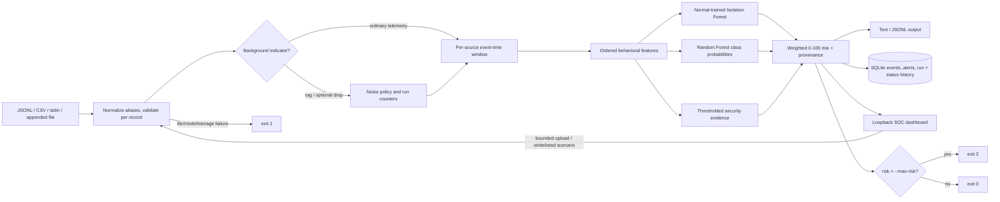

# Cyber Sentinel

An explainable, offline-first telemetry triage prototype: validate and normalize JSONL/CSV security records, derive per-source behavioral windows, classify threats, score anomaly and behavior, preserve traceable evidence in SQLite, and apply an explicit risk gate. A loopback SOC-style dashboard runs the same scanner when an operator clicks **Scan**.

**Scope:** This project analyzes supplied telemetry; it does not capture packets, block hosts, or perform response actions. All bundled datasets are synthetic fixtures, not real-world telemetry.

## Problem and solution

Operators need to correlate security signals across event time without losing malformed-row visibility, distinguish low-priority background noise from behavior worth review, understand the measurements behind an alert, retain an audit trail, and make batch policy outcomes deterministic.

The same pipeline supports files, stdin, appended-file replay, CSV, and the interactive dashboard:

```text
RAW TELEMETRY -> PARSE / VALIDATE -> TAG OR DROP NOISE -> SOURCE WINDOWS
 -> ISOLATION FOREST + RANDOM FOREST + BEHAVIOR RULES -> RISK + EVIDENCE
 -> TERMINAL / DASHBOARD + SQLITE RUN AUDIT -> --max-risk EXIT STATUS
```

## Architecture



## Detection models and taxonomy

The required canonical classes are `Normal`, `PortScan`, `BruteForce`, `LateralMovement`, and `DataExfiltration`; `Beaconing` is an optional sixth class. Human-readable dataset labels (`Port Scan`, `Brute Force`, `Lateral Movement`, `Data Exfiltration`) and legacy `Exfiltration` normalize to the canonical names.

* **Isolation Forest:** deterministic stdlib implementation; 64 isolation trees; fixed seed 1729; fit only on Normal training rows; subsample capped at 256; threshold is the 95th percentile of training-Normal scores. The output is a normalized 0–1 path-length anomaly score. Legacy model files without a forest use an explicitly reported `robust-mad` fallback. Model metadata names the active detector.
* **Random Forest:** deterministic stdlib implementation; 24 bootstrap trees, maximum depth 7, square-root feature sampling, fixed seed 1729. Leaf class frequencies are averaged into a probability for every model class. Inputs use nonnegative `log1p` numeric values and one-hot categorical fields. A separate scaler is unnecessary for tree splits; the exact ordered feature schema and dimensions are saved and checked on model load.
* **Training and holdout:** `train` reads labeled input only; a separate `--evaluation-input` is used for metrics and is never passed into fitting. The checked-in JSON model is retrained from `data/training.jsonl`. Training metadata includes UTC time, seed, classes, features, classifier/detector configuration, and Normal baseline.

Probabilities are model estimates, not calibrated confidence guarantees. The stdlib forests are transparent JSON trees rather than scikit-learn or imported pickle objects; reference `.pkl` files are intentionally not loaded.

## Ingestion, validation, and noise

Accepted inputs include ISO-8601 timestamps and numeric epoch seconds/milliseconds, valid IPv4/IPv6, ports 0–65535, bounded nonnegative integer counters, supported event types/protocol strings, and normalized authentication results. Common aliases include `time`/`ts`, `src_ip`/`src`, `dest_ip`/`dst`, `sport`/`dport`, `proto`, `byte_count`/`bytes_sent`/`bytes_out`, `packet_count`, `auth`/`auth_status`, `type`/`kind`, and `label`/`class`/`threat_class`. Addresses are canonicalized; unexpected source fields remain in the original raw record.

JSONL is the default for stdin. File suffix `.csv` is auto-detected for scans, training, and evaluation; override with `--input-format jsonl|csv`. CSV uses a header row. Each row is normalized independently. Bad JSON/CSV, non-object records, invalid IPs/ports/counters/timestamps, missing labels during training, and unsupported event types are reported and skipped; later valid records continue.

Routine DHCP, NTP, SSDP, mDNS, LLMNR, ARP, IGMP, multicast/broadcast, and common service-port indicators are tagged with reasons. By default, tagged rows are still scored with a transparent 0.65 risk discount **only if no direct behavioral heuristic fires**. `--drop-noise` instead counts and skips tagged rows. Unknown/special address classification uses Python’s `ipaddress` behavior and is a heuristic, not asset ownership truth.

## Sliding-window behavioral features

The default source-scoped event-time window is 60 seconds (`--window-seconds`), with fixed 30-/60-second subwindows. Per-source retained history is bounded. The inference schema is one authoritative `FEATURE_NAMES` tuple in `sentinel/models.py`; model metadata includes the exact order, one-hot categories and feature count. In addition to per-record bytes/packets/ports and event/protocol/action categories, it contains:

`event_count`, `unique_dest_ips`, `unique_dest_ports`, `auth_attempts`, `auth_failures`, `auth_fail_ratio`, `total_bytes_sent`, `total_bytes_received`, `bytes_out_ratio`, `total_packets`, `protocol_diversity`, `peer_rarity_score`, `high_port_ratio`, `event_rate_per_sec`, plus rolling service/admin-port diversity, 30/60/overall rates, denial count, bytes/packets per connection, source/destination novelty, unique accounts, short-lived connection count, inter-arrival timing and prior-volume comparison. Private IPv4/IPv6 destinations and user-supplied CIDRs count as internal (`--internal-network CIDR`, repeatable).

## Risk, evidence, and policy

Default weights are anomaly `0.30`, classifier `0.45`, and direct behavioral evidence `0.25`; caller-supplied weights normalize to one. Classifier contribution is severity-adjusted by the per-class coefficients in `sentinel/models.py`; behavioral contribution uses the strongest normalized threshold signal rather than summing duplicate symptoms. All points are explicit, noise adjustment is returned separately, and final scores clamp/round to 0–100:

```text
risk = clamp(round(anomaly_points + classifier_points + behavior_points), 0, 100)
Normal 0–30 | Suspicious 31–70 | Malicious 71–100
```

Default heuristic thresholds (all repeatably adjustable as `--threshold NAME=VALUE`) are 5 unique ports, 10 destinations, 15 events per 30 seconds, 12 short-lived connections, 5 failed logins, 0.70 authentication failure ratio, 4 accounts, 3 new internal peers, 5 administrative-service connections, 1,000,000 outbound bytes, a 500,000-byte minimum before ratio/baseline comparisons, outbound/inbound ratio 8, prior-volume multiplier 8, and 5 denials. Evidence carries observed values, thresholds, impact/contribution, timestamp, source/destination, record ID, and all source-window record IDs. Isolation Forest feature annotations are robust-baseline deviation cues, not SHAP or causal attribution.

`scan --max-risk N` finishes replay then returns `2` if any scored risk is strictly greater than `N`; otherwise `0`. Input/model/storage errors return `1`; Ctrl+C during a scan returns `130`. Rejected malformed rows do not independently trigger the risk gate.

## SQLite audit and alert workflow

SQLite stores normalized event/raw JSON, risk band/score, class probabilities, confidence, anomaly score and detector, model version, features, evidence, risk components/weights, noise discount, contributing raw-record IDs and triage status (`NEW`, `REVIEWED`, `RESOLVED`). Status changes are appended to `alert_status_history`; `telemetry_runs` persists input source/format, lines, valid/malformed/noise/dropped counts, alerts, peak risk and policy outcome. Existing alert tables are migrated additively. Indexes cover event timestamp/source, alert risk/status, run time, and status history.

## SOC dashboard

Run:

```powershell
python -m sentinel web --port 8765
```

Open <http://127.0.0.1:8765>. The dashboard calls the real scanner subprocess via an argument vector (`python -m sentinel scan`), streams results and warnings, and offers:

- Demo, Normal, Port Scan, Brute Force, Lateral Movement, Data Exfiltration, Beaconing, benign-noise, hostile/malformed, and bounded JSONL upload replay.
- Optional max-risk gate and noise-drop control.
- Live risk trace; Normal/Suspicious/Malicious and class distributions; current scan KPIs; source ranking; search/severity filters; event inspector with probabilities, features, evidence, risk components, original event and contributing record IDs.
- SQLite-backed history, details, related source records, pending triage and status workflow; latest-run policy outcome.

Only whitelisted scenario names can select bundled paths. Uploads are limited to 2 MiB and 5,000 non-empty records; a scan has a 120-second timeout and only one can run at a time. The server binds to loopback only, checks host/origin/content type, rejects cross-origin scan requests and does not accept arbitrary paths. It has no authentication and is not safe to expose through a proxy or remote bind.

## Synthetic data and evaluation

`data/training.jsonl` and `data/evaluation.jsonl` are deterministic independently seeded synthetic fixtures; `data/demo.jsonl` deliberately includes malformed and unsupported rows; `data/scenarios/` contains labeled threat, noise and hostile replays. Generate fixtures with:

```powershell
python -m sentinel generate-data --seed 1729 --cases 12
```

Train on one file and evaluate on the separate holdout:

```powershell
python -m sentinel train --input data/training.jsonl --evaluation-input data/evaluation.jsonl --output models/sentinel-model.json
python -m sentinel evaluate --input data/evaluation.jsonl --model models/sentinel-model.json
```

Current metrics and exact confusion counts are recorded in [REPORT.md](REPORT.md). They are a **synthetic fixture evaluation** from related generation rules, not real-world efficacy or a claim of generalization. The report also gives anomaly misses and false alarms.

## Install and commands (Windows PowerShell)

Python 3.11+; runtime has no third-party dependencies.
The wheel includes the default model, demo/evaluation/training fixtures, bundled scenarios and dashboard; when run outside a source checkout, newly generated data and trained models are written under the current directory.

```powershell
cd "C:\Users\Tushar\Desktop\problem solution"
python -m venv .venv
.\.venv\Scripts\Activate.ps1
python -m pip install -e .
python -m sentinel --help
```

```powershell
python -m sentinel train
python -m sentinel evaluate
python -m sentinel scan --input data\demo.jsonl --format json
python -m sentinel scan --input data\scenarios\portscan.jsonl --max-risk 70
python -m sentinel scan --input data\scenarios\noise.jsonl --drop-noise
python -m sentinel scan --input data\training.csv --input-format csv
Get-Content data\scenarios\hostile.jsonl | python -m sentinel scan --input -
python -m sentinel scan --input data\live.jsonl --follow
python -m sentinel web --port 8765
python -m unittest discover -s tests -v
```

See [DEMO.md](DEMO.md) for an end-to-end walkthrough, [REPORT.md](REPORT.md) for the editable report source, and [REPORT.pdf](REPORT.pdf) for the submission-ready PDF.

## Limitations

- There is no representative, permissioned real-world labeled dataset; synthetic train/holdout examples share generator structure and can substantially overstate generalization.
- Isolation Forest misses some synthetic attack events at the current Normal-only 95th-percentile operating point; the report records the exact false negatives/positives.
- Gaussian-distribution probabilities are not used; Random Forest leaves provide empirical class fractions but are uncalibrated.
- Heuristic thresholds and the noise discount need operator calibration; peer novelty/internal status uses bounded replay history and `ipaddress`, not a CMDB, asset roles, NAT identity or topology.
- This is a single-user local replay prototype, not a production SOC service; no packet capture, authenticated remote service, notification, high availability, immutable/tamper-proof log, automated blocking, or throughput SLA is implemented.
