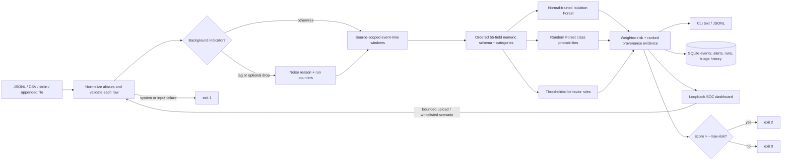

# Cyber Sentinel — solution, judging alignment, and evaluation

**Challenge:** IT HAPPENS @ RAALE #11 — Intelligent Cyber Threat and Network Anomaly Detection
**Implementation:** Python 3.11+; stdlib runtime; CLI, JSONL/CSV parser, deterministic synthetic-data generator, JSON model, SQLite audit store, and loopback SOC dashboard.
**Evaluation scope:** all bundled data is synthetic. Results below are reproducible measurements on generated fixtures, not real-world validation.

## Executive summary

Cyber Sentinel is an evidence-first telemetry analysis tool. It accepts JSONL or CSV, stdin or file replay, normalizes aliases and validates each record independently, computes source-scoped time-window features, applies a Normal-trained Isolation Forest, a multiclass Random Forest, and direct behavior thresholds, then emits a bounded risk score with provenance-linked evidence. SQLite records events, alerts, model/risk details, scan summaries, and analyst status changes. A local dashboard launches the same scanner and exposes results and triage workflow. Batch scans can gate on `--max-risk`.

The project retains the original dependency-free Python architecture and the existing scan/train/dashboard workflows. Upgrades are incremental: canonicalized taxonomy, expanded and versioned feature schema, a JSON-serialized supervised forest, primary Isolation Forest plus labeled MAD fallback, stronger anomaly/class evaluation, noise controls, broader audit state, scenario replay, and refreshed user documentation.

This is a local replay/triage prototype—not a packet sniffer, prevention system, authenticated multi-user service, or production SOC platform.

## Official judging-category requirements matrix

Weights below follow the supplied brief. Evidence references automated tests by module/class and the exact synthetic evaluation in the next section.

| Judging category | Weight | Implemented behavior and evidence | Verification and honest limit |
|---|---:|---|---|
| Telemetry ingestion & feature extraction | 15 | JSONL/CSV, stdin, file replay and appended-file `--follow`; timestamp/IP/counter/label aliases and validation; 55 ordered numeric behavioral features plus event/protocol/action one-hot fields; default 60-second source windows with short/medium subwindows; record/window provenance; configurable internal CIDRs. | `HostileInputTests`, `BehavioralFeatureTests`, CSV CLI tests and fixture-generator CSV test exercise parsing, recovery, window expiry/rates, peers, services, bytes and record IDs. No live packet capture or external asset inventory. |
| Anomaly detection & behavioral analysis | 20 | Primary deterministic, Normal-only `stdlib-isolation-forest`, 64 trees and Normal-training 95th-percentile threshold; normalized 0–1 score, anomaly decision and feature deviation evidence. Direct rules cover port/destination fanout, rates, short connections, authentication bursts, internal peer/service novelty and outbound transfer spikes. Legacy `robust-mad` models are explicitly identified as fallback. | `DetectorAndPolicyTests` and `ThreatEvidenceTests`; held-out synthetic IF recall 81.15%, with 36/191 threat events missed and 4/30 Normal events flagged. A fixed Normal quantile did not maintain a 5% false-positive rate on this generated holdout; detection is imperfect. |
| Threat classification | 15 | JSON-serialized deterministic stdlib Random Forest with required canonical classes `Normal`, `PortScan`, `BruteForce`, `LateralMovement`, `DataExfiltration`, plus optional `Beaconing`; class probabilities, top class and confidence. Training refuses missing required primary classes. | Held-out synthetic 221-record accuracy 99.10%, macro-F1 98.89%; all 191 synthetic threat labels correct, with 2 of 30 Normal rows labeled Beaconing. This is a same-generator synthetic holdout, not a claim of generalization. |
| Risk scoring & explainability | 15 | Deterministic 0–100 sum of weighted anomaly, severity-adjusted classifier probability, and strongest normalized behavior evidence (default weights 0.30/0.45/0.25); normalized caller overrides; explicit 0–30/31–70/71–100 bands. Ranked explanations include actual feature/threshold, contribution, timestamp, source/destination, record ID and contributing window IDs. | Tests assert bounds, determinism, weight normalization, component reconciliation, evidence ordering and traceability. Evidence is a rules/model observation, not causal attribution or SHAP. |
| Audit logging & dashboard | 10 | SQLite events, alerts, raw-event linkage, features/probabilities/evidence/components/weights, detector/model versions, noise discount, `NEW`/`REVIEWED`/`RESOLVED` and append-only status history; run-level valid/malformed/noise/drop counts, risk peak and policy result. Dashboard runs the real CLI scanner, plots risk/class/band trends and supports record inspection, filters, scenario replay, bounded JSONL uploads and triage. | Six dashboard integration tests exercise serving, a real scanner subprocess, detailed alert/history, status mutation, summary/policy, noise-drop scenario, hostile requests and loopback binding. UI is unauthenticated and intentionally loopback-only. |
| Policy guardrail & automation | 10 | `--max-risk N` returns `2` only when a replayed score is strictly greater than N; returns `0` otherwise and `1` on input/model/storage/configuration error (`130` on interrupt). Thresholds, weights, windows, network CIDRs and noise dropping are configurable. | CLI and dashboard scenario tests check a policy breach; CLI tests exercise successful and failing outcomes. This gate evaluates replayed records, not an automated response or live enforcement point. |
| Noise / hostile-input resilience | 10 | Tagged background indicators include DNS/DHCP/ARP/multicast/discovery, common NTP/SSDP/mDNS/LLMNR service ports and special destinations; optional drop counts them; otherwise discount applies only when no direct behavior evidence exists. Malformed/unknown/invalid rows warn and are skipped without aborting subsequent rows. Upload, record, scan-time, and scenario-path boundaries are enforced. | Hostile-input tests cover malformed/nonfinite JSON, missing/invalid fields, IPs/ports/counters, large values, aliases, duplicates, unknown types and continued processing; noise and attack fixtures check behavior. These tests do not constitute a formal fuzzing or penetration test. |
| Documentation & demonstration | 5 | README explains install, commands, pipeline, model, features, risk, audit, dashboard, generated data and limitations; this report maps each weighted criterion; `DEMO.md` gives a 3–5-minute reproducible operator flow and PowerShell commands. Mermaid architecture included. | `python -m unittest discover -s tests -v` passes **73 tests** under Python 3.13 with `ResourceWarning` promoted to error. No external reviewer scoring or real-data validation is claimed. |

## Architecture and data flow



## Implementation details

### Taxonomy and supervised model

Canonical labels shared across training, evaluation, output and dashboard are `Normal`, `PortScan`, `BruteForce`, `LateralMovement`, `DataExfiltration`, and optional `Beaconing`. The JSON model contains 24 deterministic bootstrap trees (seed 1729, maximum depth 7, square-root feature sampling); leaf class frequencies produce uncalibrated probabilities. Numeric values receive `log1p`, categorical fields are one-hot encoded. Model files persist class list, model configuration, exact input feature schema/order/count, and training metadata. A separate standard scaler is unnecessary for axis-aligned tree splits.

Training uses only `--input`; a separate `--evaluation-input` is loaded after fitting, and evaluation data is never used to train. The trainer rejects a dataset missing any of the five required classes. The bundled model is JSON, not a pickle; the reference archive’s third-party-dependent model artifacts were not copied.

### Anomaly detector

The primary detector is an in-project standard-library Isolation Forest over engineered numeric features (not raw text), fit only on Normal-labeled training rows, with 64 trees, deterministic seed 1729, and a capped sample of 256. The anomaly threshold is the 95th percentile of Normal training scores. The response reports detector name, normalized 0–1 score, threshold decision and contributing robust-baseline feature deviations. Deviation annotations describe observed difference; they are not feature-attribution guarantees.

Older model formats lacking Isolation Forest metadata use the Robust MAD path, and output explicitly reports `robust-mad`. The current checked-in v3 model reports `stdlib-isolation-forest`.

### Feature engineering and evidence

`sentinel/models.py` defines the one authoritative ordered set of **55 numeric features**, with `event_type`, `protocol`, and `action` as categorical fields. They include per-event byte/packet/port/duration; source-window event, connection, byte and packet rates; destinations, ports, services, protocols and accounts; auth failures/successes and ratio; denial/short-lived counts; source-destination and destination novelty; internal peer and administrative-service diversity; outbound/inbound ratio and prior-volume change; inter-arrival timing; high-port ratio; and noise tag. Derived feature windows retain the IDs of the records that contributed.

Default overall window is 60 seconds; the engine also calculates 30-, 60-, and 300-second rates. Input is processed in order and per-source retained history is bounded. RFC-private IPv4/IPv6 ranges are internal by default; `--internal-network CIDR` extends the definition. The score rules provide actual-value explanations:

- **Port scan:** distinct ports/destinations, 30-second connection rate and short-lived count.
- **Brute force:** failed authentication count/ratio, account diversity and burst rate.
- **Lateral movement:** newly observed internal peers and administrative-service access.
- **Exfiltration:** outbound byte volume, outbound/inbound ratio and change from prior source volume.

Rule thresholds are explicit, overrideable as repeatable `--threshold NAME=VALUE`. Evidence is ranked by contribution and links the alert back through contributing record IDs to original raw input; a classification or anomaly observation alone is not presented as proof.

### Risk and policy semantics

The default normalized weights are anomaly `0.30`, classifier `0.45`, behavior `0.25`. The classifier component uses class probability adjusted by the class severity coefficient; the behavior component uses the strongest normalized direct rule to avoid adding several correlated symptoms as if independent. Components (including a transparent noise discount where applicable) are returned separately; the rounded sum is clamped to `[0,100]`.

```text
risk = clamp(round(anomaly contribution
                 + severity-adjusted classifier contribution
                 + strongest behavior-evidence contribution), 0, 100)
Normal: 0–30    Suspicious: 31–70    Malicious: 71–100
```

Noise is discounted by 0.65 only when a row is tagged and no direct behavioral heuristic fires. With `--drop-noise`, tagged records are counted but not scored or persisted. `--max-risk` is strict `>`: equality is allowed.

### Persistence and web boundary

SQLite migrations add detector/model version, probabilities, raw contributor IDs, features, components/weights, noise discount, statuses, status history and run summaries while preserving earlier event/alert records. Dashboard operations use the same database. Upload JSON body is capped at 2 MiB and 5,000 non-empty records, jobs at 5,000 scored events and 120 seconds, and only one scan runs at a time. The dashboard accepts fixed fixture names, not client-supplied filesystem paths; its scanner uses the current Python executable and argument-vector subprocess without a shell. It binds to loopback only, checks local Host/Origin, JSON content type and request size, and adds `nosniff`/`no-store` response headers. It is a local analyst interface without authentication; do not expose it remotely.

## Reproducible evaluation

### Dataset and commands

Training contains 467 labeled synthetic records generated from seed 1729 across six classes and varied event patterns. Evaluation is a separate 221-record synthetic fixture generated with seed 1730 and separate cases. The generator shares underlying scenario logic between the two sets, so despite different seeds and dates this is not an independent real-world distribution. It is useful for repeatability and feature/model regression only.

Regenerate, fit, and evaluate from the project root:

```powershell
python -m sentinel generate-data --seed 1729 --cases 12
python -m sentinel train --input data\training.jsonl --evaluation-input data\evaluation.jsonl --output models\sentinel-model.json
python -m sentinel evaluate --input data\evaluation.jsonl --model models\sentinel-model.json
```

### Multiclass results

Observed by the command above against the current synthetic holdout (221 accepted labeled records, zero rejected):

| Metric | Result |
|---|---:|
| Accuracy | 0.99095 (99.10%) |
| Macro-F1 | 0.98888 (98.89%) |
| Threat-class false positives (Normal predicted as threat) | 2 of 30 Normal |
| Threat-class false negatives (threat predicted Normal) | 0 of 191 threat |

Per-class metrics:

| Actual class | Support | Precision | Recall | F1 |
|---|---:|---:|---:|---:|
| Normal | 30 | 1.0000 | 0.9333 | 0.9655 |
| PortScan | 55 | 1.0000 | 1.0000 | 1.0000 |
| BruteForce | 39 | 1.0000 | 1.0000 | 1.0000 |
| LateralMovement | 35 | 1.0000 | 1.0000 | 1.0000 |
| DataExfiltration | 32 | 1.0000 | 1.0000 | 1.0000 |
| Beaconing | 30 | 0.9375 | 1.0000 | 0.9677 |

Rows are actual labels; columns are predictions:

| Actual \ Predicted | Normal | PortScan | BruteForce | LateralMovement | DataExfiltration | Beaconing |
|---|---:|---:|---:|---:|---:|---:|
| Normal | 28 | 0 | 0 | 0 | 0 | 2 |
| PortScan | 0 | 55 | 0 | 0 | 0 | 0 |
| BruteForce | 0 | 0 | 39 | 0 | 0 | 0 |
| LateralMovement | 0 | 0 | 0 | 35 | 0 | 0 |
| DataExfiltration | 0 | 0 | 0 | 0 | 32 | 0 |
| Beaconing | 0 | 0 | 0 | 0 | 0 | 30 |

### Anomaly results

The same 221 rows contain 30 Normal and 191 threat rows. At the saved threshold `0.311728`:

| Metric | Result |
|---|---:|
| Accuracy | 0.81900 (81.90%) |
| Threat precision | 0.97484 (97.48%) |
| Threat recall | 0.81152 (81.15%) |
| Threat F1 | 0.88571 (88.57%) |
| Normal flagged anomalous (false positives) | 4 / 30 |
| Threat treated as Normal (false negatives) | 36 / 191 |

| Actual \ Detector decision | Normal | Anomaly |
|---|---:|---:|
| Normal | 26 | 4 |
| Threat | 36 | 155 |

These results indicate the current Isolation Forest is conservative and misses a meaningful share of generated threat events. The label classifier and explicit behavioral rules are separate signals; no layer should be interpreted as a guarantee. Numbers are not expected to predict performance on real enterprise telemetry.

### Functional and end-to-end checks

The exact quality-gate command currently passes **73 tests**:

```powershell
python -W error::ResourceWarning -m unittest discover -s tests -v
```

Coverage includes hostile parser values and row recovery, aliases/CSV, time-window feature values/expiry and source scoping, bounded feature history, canonical classes, required-class training, model metadata/schema validation, probability sums/determinism, Isolation Forest and MAD fallback identification, evidence ordering/provenance, risk bounds and weight policy, every required threat evidence pattern, benign noise, generated fixture determinism, evaluation confusion accounting, CLI CSV/drop-noise/train/scan/gate behavior, real scanner dashboard subprocess, SQLite audit/run/status history, summary APIs, invalid upload/path, cross-origin rejection and loopback enforcement. The web suite tests the rendered page and the API/data path; visual QA was also performed in a local browser by the project operator.

Other reproducible commands:

```powershell
python -m sentinel scan --input data\demo.jsonl --format json
python -m sentinel scan --input data\training.csv --max-risk 100
python -m sentinel scan --input data\scenarios\hostile.jsonl
python -m sentinel scan --input data\scenarios\noise.jsonl --drop-noise
python -m sentinel web --port 8765
```

The dashboard test completes a real scan of the 36-line demo fixture: 34 records accepted, 2 rejected with warnings, and all scored rows linked to details and persisted audit history. That is a functional count, not a detection-performance metric.

## Security review and limits

A scoped read-only security review found **no exploitable vulnerabilities** in the reviewed implementation. The dashboard design intentionally avoids arbitrary file-path input and shell execution: bundled replays resolve only from a fixed name map, JSONL uploads are size/count bounded, a job limit and timeout are applied, host/origin/type checks are made, and binding is loopback-only. SQLite uses parameterized values, a busy timeout, foreign keys and uniqueness/range constraints. These are defensive implementation choices, not a formal certification or proof of security. The test suite includes cross-origin rejection, path-like upload rejection and remote-bind rejection; this is not exhaustive fuzzing or penetration testing.

The wheel was built and installed into a temporary target with no dependencies, then exercised outside the source checkout: packaged default training, scan and evaluation ran, and dashboard/model/data/scenario resources were present. This package smoke does not replace testing in every supported Python 3.11+ environment.

Additional limitations:

- All labeled data is synthetic and generated by related code; both high classifier metrics and feature patterns may reflect generator shortcuts. Do not describe them as field accuracy.
- The current Isolation Forest holdout misses 36 generated attack rows; alert triage requires calibrated data and thresholds.
- Random Forest leaf-frequency probabilities are not calibrated confidence intervals.
- Source-IP grouping is not a substitute for user identity, NAT resolution, asset roles, CMDB, or topology context; peer novelty is bounded by the replay window/history.
- Noise tagging uses event attributes/service ports and address classification, not a network’s actual policy or asset inventory.
- SQLite is local and editable, not an immutable forensic log; no alerts are sent and no hosts are blocked.
- The web service has no authentication, CSRF tokens for same-origin users, TLS, multi-user separation, rate limiting beyond scan boundaries, reverse-proxy mode, or remote-bind support. Keep it on loopback.
- Throughput, memory use at enterprise scale, timestamp disorder behavior, operational drift and production false-positive rates have not been benchmarked.

## Future work

Evaluate on a permissioned, representative time-separated dataset; calibrate the detector threshold and class probabilities; add topology/identity/asset context; expand controlled baselines for each host role; benchmark and fuzz parser/window behavior; consider authenticated remote operations only with a separate threat model; and preserve audit records in controlled, backed-up storage.
